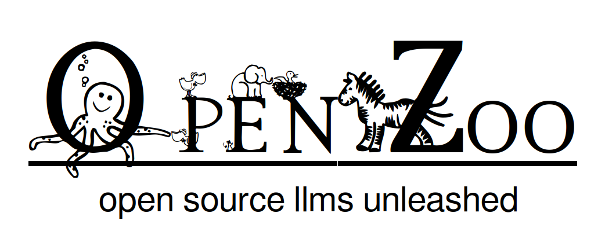

# openzoo-python
The official Python docs for OpenZoo



---

The OpenZoo API is the easiest way to use open-source LLMs because:

1. **You already know how to use it**: simply use the official [OpenAI](https://github.com/openai) client for your language of choice by changing the base_url parameter
2. **You don't need to select a model from the ever-changing leaderboards** - just provide a **spec** like 'chat', 'summarization', 'code' or 'math', we always serve the latest best model for the job
3. **We keep adding features so you can write less code**: If you specify 'chat safe' (releasing next Friday!), we add a [Llama-guard](https://ai.meta.com/research/publications/llama-guard-llm-based-input-output-safeguard-for-human-ai-conversations/) circuit-breaker to keep your responses safe! Soon, you will be able to just specify 'chat safe eu-compliant spanish' and save precious lines of code that you will need to maintain.
4. **When you need to, you can still specify exactly which model you want**: simply specify the HuggingFace handle like 'mistralai/Mixtral-8x7B-Instruct-v0.1' and all parameters supported by the Openai client to get full control when you need it.

*We are in closed alpha right now, watch this space!*

---

# Getting Started

1. **If you would like to be an alpha-tester, please get in touch: contactus@openzoo.ai** for an API key with $25 in your account.

2. Once you have an API key, please click the 'Open in Colab' badge on any of the notebooks in this repository to get started on OpenZoo right away.

---

# Usage

Instantiate the OpenZoo client using the [OpenAI Python package](https://github.com/openai/openai-python). 
- Set 'api_key' to the OpenZoo API key
- Set 'base_url' to 'https://api.openzoo.ai/v1'

```python
from openai import OpenAI

client = OpenAI(
    api_key="<OPENZOO_API_KEY>",
    base_url="https://api.openzoo.ai/v1"
)
```
---

**Basic inference** - where you would normally specify a model, you provide a **spec**. Currently, you can specify one of:
- 'chat'
- 'code'
- 'summarization'
- 'math'

*This will keep updating - we release a new feature every week!*

```python
response = client.chat.completions.create(
    model="chat",
    messages=[{"role": "system", "content": "You are a helpful but brief assistant."},
              {"role": "user", "content": "Tell me a joke about unicorns"}],
    stream=False,
)
```

---

**Streaming** - just set 'stream' to 'True'

```python
stream = client.chat.completions.create(
    model="chat",
    messages=[{"role": "system", "content": "You are a helpful but brief assistant."},
              {"role": "user", "content": "Tell me a joke about bunnies"}],
    stream=True,
)

chunk = None
content = ""

for chunk in stream:
    content += chunk.choices[0].text
    print(chunk.choices[0].text, end="", flush=True)
```

**Embeddings** - just specify the model as you would with OpenAI (embedding models listed below)

```python
client.embeddings.create(input = ["Some text that needs to be embedded"], model='togethercomputer/m2-bert-80M-8k-retrieval')
```

---

**The Spec**

Where you would normally provide a model name in OpenAI, you provide a **spec** in OpenZoo.

Currently, you can specify tasks:

- chat
- code
- summarization
- math

Sizes:

- XL
- L
- M
- S
- XS

Context-lengths:

- XL-context (~64000 tokens)
- L-context  (~32000 tokens)
- M-context  (~16000 tokens)
- S-context  (~8000 tokens)

And a (growing) list of *modifiers*:

- safe

For example,

```python
response = client.chat.completions.create(
    model="chat XS safe",
    messages=[{"role": "user", "content": "Tell me a joke about elephants"}],
    stream=False,
)
```

Here we see an extra-small chat model, with a built-in safety circuit breaker.


You can just provide your spec as space-separated combinations as above. Currently, these are the models we use to serve these specs:

| Category       | Chat                                                            | Code                                   | Summarization                          | Math                                 |
|----------------|-----------------------------------------------------------------|----------------------------------------|----------------------------------------|--------------------------------------|
| XL             | databricks/dbrx-instruct, mistralai/Mixtral-8x22B-Instruct-v0.1 | databricks/dbrx-instruct               | mistralai/Mixtral-8x22B-Instruct-v0.1  | databricks/dbrx-instruct             |
| L              | meta-llama/Llama-3-70b-chat-hf                                  | codellama/CodeLlama-70b-Instruct-hf    |                                        | meta-llama/Llama-3-70b-chat-hf       |
| M              | mistralai/Mixtral-8x7B-Instruct-v0.1                            | codellama/CodeLlama-34b-Instruct-hf    | mistralai/Mixtral-8x7B-Instruct-v0.1   | mistralai/Mixtral-8x7B-Instruct-v0.1 |
| S              | meta-llama/Llama-2-7b-chat-hf, meta-llama/Llama-3-8b-chat-hf    | codellama/CodeLlama-7b-Instruct-hf     | google/gemma-2b-it, microsoft/phi-2    | meta-llama/Llama-3-8b-chat-hf        |
| XS             | google/gemma-2b-it, microsoft/phi-2                             |                                        | google/gemma-2b-it, microsoft/phi-2    | google/gemma-2b-it                   |
| XL-context     | mistralai/Mixtral-8x22B-Instruct-v0.1                           |                                        | mistralai/Mixtral-8x22B-Instruct-v0.1  |                                      |
| L-context      | databricks/dbrx-instruct, mistralai/Mixtral-8x7B-Instruct-v0.1  | databricks/dbrx-instruct               | mistralai/Mixtral-8x7B-Instruct-v0.1   | mistralai/Mistral-7B-Instruct-v0.2   |
| M-context      |                                                                 | codellama/CodeLlama-34b-Instruct-hf, codellama/CodeLlama-13b-Instruct-hf, codellama/CodeLlama-7b-Instruct-hf|     |    |
| S-context      | meta-llama/Llama-3-70b-chat-hf, meta-llama/Llama-3-8b-chat-hf   | code-llama/CodeLlama-7b-Instruct-hf    | google/gemma-2b-it                     | meta-llama/Llama-3-70b-chat-hf       |
                  

**If you don't provide a size parameter, OpenZoo automatically defaults to 'S'**

*We release a feature every Friday, so expect this space to grow!*

**Embedding models**

- togethercomputer/m2-bert-80M-2k-retrieval
- togethercomputer/m2-bert-80M-8k-retrieval
- togethercomputer/m2-bert-80M-32k-retrieval
- WhereIsAI/UAE-Large-V1
- BAAI/bge-large-en-v1.5
- BAAI/bge-base-en-v1.5
- sentence-transformers/msmarco-bert-base-dot-v5
- bert-base-uncased

---

**Pricing**

Pricing for inference is solely based on size:

| Size | Price per million tokens |
|------|-------------------------|
| XL   | $1.20                   |
| L    | $0.90                   |
| M    | $0.60                   |
| S    | $0.20                   |
| XS   | $0.10                   |

Embedding

| Model                                          | Price per million tokens |
|------------------------------------------------|--------------------------|
|togethercomputer/m2-bert-80M-2k-retrieval       | $0.008                   |
|togethercomputer/m2-bert-80M-8k-retrieval       | $0.008                   |
|togethercomputer/m2-bert-80M-32k-retrieval      | $0.008                   |
|WhereIsAI/UAE-Large-V1                          | $0.016                   |
|BAAI/bge-large-en-v1.5                          | $0.016                   |
|BAAI/bge-base-en-v1.5                           | $0.008                   |
|sentence-transformers/msmarco-bert-base-dot-v5  | $0.008                   |
|bert-base-uncased                               | $0.008                   |

---

**Examples**

Chat (with an extra-small model)

```python
response = client.chat.completions.create(
    model="chat XS",
    messages=[{"role": "user", "content": "Tell me a joke about squirrels"}],
    stream=False,
)
```

Safety (can be added to any task type)

```python
response = client.chat.completions.create(
    model="chat XS safe",
    messages=[{"role": "user", "content": "Tell me a joke about squirrels"}],
    stream=False,
)
```

Summarization (using an extra-large context model)

```python
response = client.chat.completions.create(
    model="summarization XL-context",
    messages=[{"role": "user", "content": """
Urban Lab - Centre for Science and Environment Analysis
Report 1
Winter pollution in India: Overview of
the crisis
In 2020 the Urban Lab at the Centre for Science and Environment (CSE) started publishing the state of
winter air quality among cities and towns of India that have realtime air quality monitoring. The analysis
of the winter of 2022-23 covered 234 cities. The assessment of the seasonal trend in PM2.5
concentration was done by sourcing realtime data from 440 CAAQMS stations via CPCB´s online portal.
A huge volume of data points have been cleaned and data gaps have been addressed based on the
USEPA method for this analysis. Winter has been defined as 1 October to 28 February. A minimum of 90
days of valid 24-hour values was deemed mandatory to assign a seasonal/winter PM2.5 level to a
station. Cities with multiple stations are represented by the mean of all the city stations that meet the
minimum data requirement for both 2021-22 winter and 2022-23 winter.
Regional levels have been constructed using the mean of all cities with valid seasonal levels in the
particular region. India level has been determined as the mean of regional levels. These regional and
national levels are only indicative.
National and regional: North India was the most polluted region despite registering an improvement of
about 15 per cent from the previous winter. Sound India remains the least polluted region but PM2.5
levels have risen almost 17 per cent from the previous year. Pollution rose in West India and Northeast
India as well. Central India registered marginal improvement in its winter air quality. Overall, the national
average air quality for the 2022-23 winter was 1.32 per cent worse compared to the previous winter (See
Table 1R1: National and regional winter PM2.5 levels)

Summarize the above text.
"""
}],
    stream=False,
)
```

Math (With a strong XL model)

```python
response = client.chat.completions.create(
    model="math XL",
    messages=[{"role": "user", "content": """
Sarah is planning her son Tom's birthday party and intends to buy 3 balloons at $0.50 each, 
2 cupcakes at $2 each, and 2 juice boxes at $1 each for each of the 10 children initially 
expected to attend. Just before the party, she finds out that 2 more children will be joining. 
Calculate the total cost Sarah will spend on balloons, cupcakes, and juice boxes for all the children. 
Assume these are the only expenses for the party.
"""}],
    stream=False,
)
```

Code

```python
response = client.chat.completions.create(
    model="code L",
    messages=[{"role": "user", "content": """
Find the total sales amount for each product category in the last quarter, 
considering only those categories that generated more than $10,000 in sales. 
Sort the categories by their total sales amount in descending order. 
Respond with only the SQL code, nothing else.
"""}],
    stream=False,
)
```
---

**Try it out**

If you have an API key, you can just clone this repository and open the 'demo.ipynb' notebook to try out OpenZoo.

The only dependency is:

```bash
pip install openai
```
**If you would like to be an alpha-tester, please get in touch: contactus@openzoo.ai**